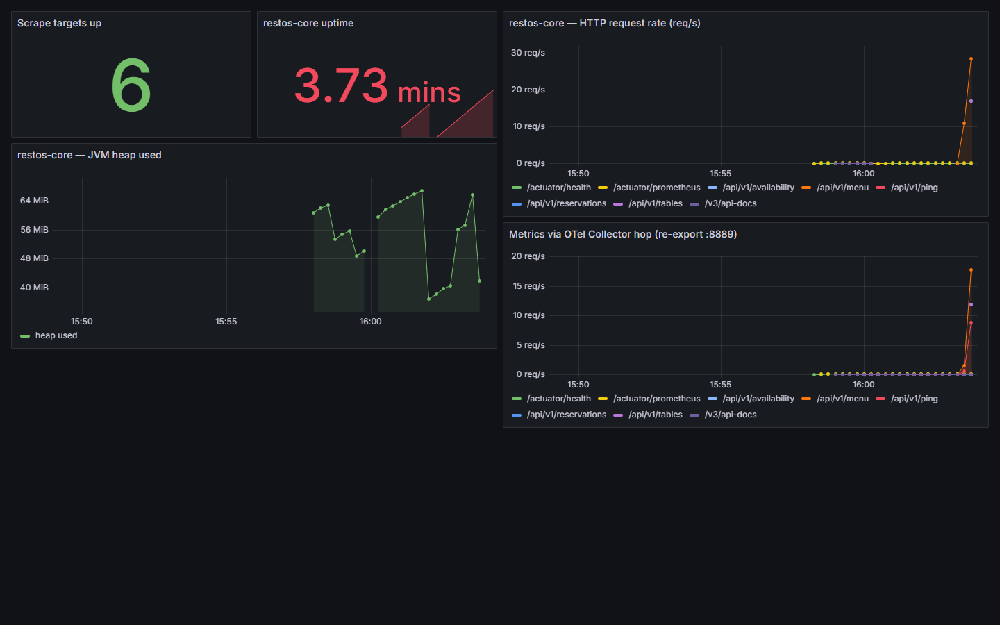

# restos-platform

The DevSecOps backbone for the [RestOS](https://github.com/arcsymer) ecosystem: a **reusable
security workflow** every repo calls, a **security retrofit** (secret + dependency scanning,
Dependabot) across all repos, and an **observability stack** (Postgres + Prometheus + Grafana) that
the services plug into.

[](https://github.com/arcsymer/restos-platform/actions/workflows/ci.yml)


## What's here

- **`.github/workflows/reusable-security.yml`** — a `workflow_call` security scan (gitleaks +
  Trivy filesystem vuln/config scan). Any RestOS repo runs it with three lines:
  ```yaml
  jobs:
    security:
      uses: arcsymer/restos-platform/.github/workflows/reusable-security.yml@main
  ```
- **`SECURITY.md`** — the ecosystem security policy and what's enforced where.
- **`compose/`** — two stacks:
  - **`docker-compose.full.yml`** — the whole ecosystem in one command (see below).
  - **`docker-compose.yml`** — a lean observability-only stack (public images, no custom builds):
    `docker compose -f compose/docker-compose.yml up` → Postgres, Prometheus, Grafana. This is the
    file CI validates with `docker compose config`.

## Run the whole stack — `docker compose up`

```sh
docker compose -f compose/docker-compose.full.yml up --build
```

One command stands up the ecosystem locally (all RestOS repos as siblings — see
[`RUNBOOK.md`](RUNBOOK.md)):

- **Postgres** backing **restos-core** (Java 21 / Spring Boot, `:8080`) with real Micrometer
  metrics at `/actuator/prometheus`;
- **restos-portal** (NestJS, SQLite, `:3000`);
- **restos-web** (Angular, static nginx, `:8081`);
- **Redpanda** + a POS **producer** and a **streaming bronze consumer** (the D1 slice → Delta Lake);
- the observability spine — **OpenTelemetry Collector → Prometheus → Grafana** (`:3001`, a
  provisioned dashboard with live app metrics).

Verified end to end — see **[docs/demo-stack.md](docs/demo-stack.md)** for the real transcript and
screenshots:



## Status — honest scope

The reusable security workflow, the cross-repo Dependabot/gitleaks retrofit, the observability
compose stack, **and now the full `docker compose up` (every app tier containerised, one command,
with a provisioned Grafana dashboard showing live metrics) plus the D1 streaming slice** are all
done and validated. It is a **local developer stack on synthetic data** — no production, no real
users, no live metrics claims beyond what the screenshots show.

## License

MIT — see [LICENSE](LICENSE). Part of the RestOS portfolio. Built end-to-end with an agentic
workflow (Claude Code), orchestrated, reviewed, and directed by me.
