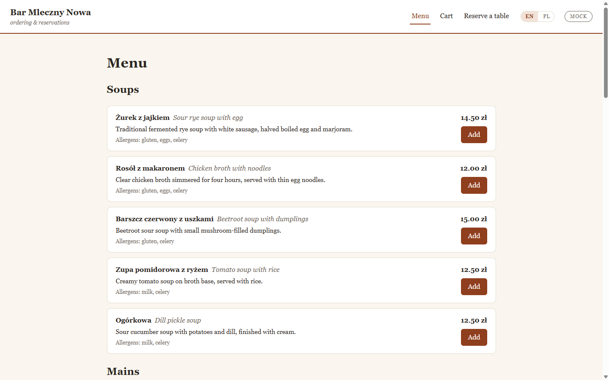

# Live local stack — demo evidence

Real output captured from `docker compose -f compose/docker-compose.full.yml up` on a local Docker
Desktop (engine 29.6.1, Compose v5.3.0). Honest scope: a local developer stack on **synthetic
data** — no production, no real users.

## Everything healthy

```text
NAME                            STATE     STATUS
restos-grafana-1                running   Up (running)
restos-otel-collector-1         running   Up (running)
restos-postgres-1               running   Up (healthy)
restos-prometheus-1             running   Up (running)
restos-redpanda-1               running   Up (healthy)
restos-restos-core-1            running   Up (healthy)
restos-restos-data-streamer-1   running   Up (running)
restos-restos-portal-1          running   Up (healthy)
restos-restos-web-1             running   Up (healthy)
```

(`restos-data-producer` runs once, sends its burst, and exits 0.)

## A request flowing through each tier

```text
# restos-core (Java 21 / Spring Boot, backed by the compose Postgres)
GET http://localhost:8080/actuator/health   -> 200  {"status":"UP"}
GET http://localhost:8080/api/v1/menu        -> 200  (seeded Bar Mleczny Nowa menu from Postgres)

# restos-portal (NestJS, SQLite)
GET http://localhost:3000/health             -> 200  {"status":"ok","service":"restos-portal"}

# restos-web (Angular, static nginx)
GET http://localhost:8081/                   -> 302 -> /en-US/  -> 200
```

## Observability: Prometheus targets

```text
otel-collector-export    up      # core metrics re-exported through the OTel Collector hop
otel-collector-self      up
prometheus               up
redpanda                 up
restos-core              up      # Micrometer /actuator/prometheus
```


The Grafana dashboard (provisioned, anonymous viewer at http://localhost:3001) shows live
`restos-core` HTTP request rate by URI, JVM heap, uptime, targets-up, and the same request-rate
series **as seen via the OTel Collector re-export** — proving the pipeline
`core → otel-collector → prometheus → grafana` is live end to end.



## D1 — streaming slice (Redpanda → Delta bronze)

```text
[producer] done: 800 events -> pos.events
[streamer] landed batch, total=800
bronze_stream rows = 800
```

800 synthetic POS events produced to Redpanda, consumed, and landed into a Delta Lake bronze table
on the `delta-data` volume — exact-count match end to end.

> Note: proof here is real command transcripts + screenshots (captured via Playwright against the
> running stack). A terminal-recording GIF wasn't produced — no asciinema/recorder on this native
> Windows host — but every line above is reproducible with `RUNBOOK.md`.
